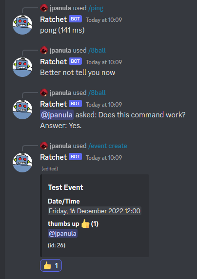

# Discord Bot

This is a personal project that contains a Discord bot and a backend API for a PostgreSQL database to be used by the bot for its functions.
It is meant as a base that should be relatively easy to add more functionality into.

## Installation

The project was programmed in C# using [Visual Studio Community 2022](https://visualstudio.microsoft.com/downloads/),
and the database used is [PostgreSQL 15](https://www.postgresql.org/download/).

The bot uses the [Discord.NET](https://discordnet.dev/) framework, and the backend API for the database uses ASP.NET Core and Entity Framework Core.

To get started, clone or download the project. You will also need to add your database connection string to the `appsettings.json` in `Backend/BackendAPI/BackendAPI`
using the key `Database:ConnectionString`. You will also need to add your [Discord Bot Token](https://discord.com/developers/docs/getting-started#creating-an-app),
database API URL and an API key to [Open Emoji API](https://emoji-api.com/) in the `appsettings.json` in `Bot/DiscordBot/DiscordBot` using the keys `BotToken`, `Database:apiUrl`
and `EmojiApiKey`. You can alternatively use the [Secret Manager](https://learn.microsoft.com/en-us/aspnet/core/security/app-secrets?view=aspnetcore-7.0&tabs=windows#secret-manager)
tool and add these to the secrets in the BackendAPI and DiscordBot projects (**recommended**). 

- Update your database by using the `Update-Database` command in the Package Manager Console when you have the BackendAPI project open in Visual Studio.
- Import the `8BallResponses.csv` from the repository root to your `Magic8BallResponse` table in your database to populate it with default values.

After following these instructions, run your BackendAPI and then DiscordBot and you should be able to see the bot come online on Discord and use the commands. (Assuming
I haven't forgotten anything)

## Bot Commands

- `/ping` - The bot responds with "pong" and displays its current client latency.
- `/8ball [question] [ephemeral]` - The bot responds with a magic 8-ball style answer. If you use the `question` parameter you can type a question that the bot will include in its response.
If you set the `ephemeral` parameter to `True` the response will be sent in a message that will only be displayed to you.

#### Event

- `/event create [title] [date] [description=""]` - Create a new event with the given `title`, `date` and optional `description`. Users can add votes to the event with reactions.
- `/event list [ephemeral=True]` - List all the existing events in the database. The list is sent as ephemeral by default, but can be sent as normal with `ephemeral` set to `False`.
- `/event get [id]` - Send a message containing the event with given `id`. This message can be reacted to and will modify the votes on the event accordingly.
- `/event delete [id]` - Delete the event with given `id`. Will prompt for confirmation.

## API Routes

- GET `/api/Magic8Ball` Get all the magic 8-ball responses
- GET `/api/Magic8Ball/random/weighted` Get a single magic 8-ball response with the same random distribution as an original magic 8-ball (50% affirmative, 25% negative, 25% noncommittal)
- POST `/api/Magic8Ball` Post a new magic 8-ball response
- DELETE `/api/Magic8Ball/{id}` Delete the magic 8-ball response with the given `id`

#### Event

- GET `/api/Events/` Get all events in database
- GET `/api/Events/{id}` Get event with given `id`
- GET `/api/Events/{id}/Votes` Get all votes on an event with given `id`
- GET `/api/Events/GetIdFromMessage/{messageId}` Get the event id that the given Discord message with id `messageId` corresponds (if exists)
- POST `/api/Events` Post a new event
- POST `/api/Events/{id}/Votes` Post a vote to an event
- POST `/api/Events/{id}/Messages` Post a new `messageId` for the event with given `id`
- DELETE `/api/Events/{id}` Delete event with the given `id`
- DELETE `/api/Events/{id}/Votes/{emoji}/{userId}` Delete a vote on the event with given `id` for the Discord custom emoji id or unicode emoji `emoji` from the Discord user with id `userId`

## To Do

- A web front end that contains instructions on the commands
- Ability to configure and manage commands from the web front end (e.g. add new magic 8-ball responses)
- Authentication to the front end with Discord account
- Adding separation by Discord server to commands that should have it (events, custom magic 8-ball responses)
- Ability for the bot to remind of events ahead of time
